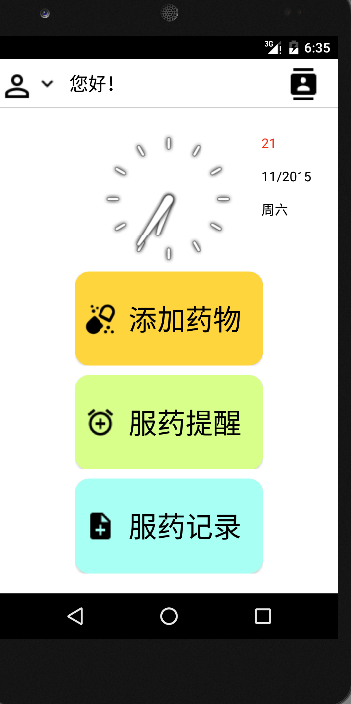
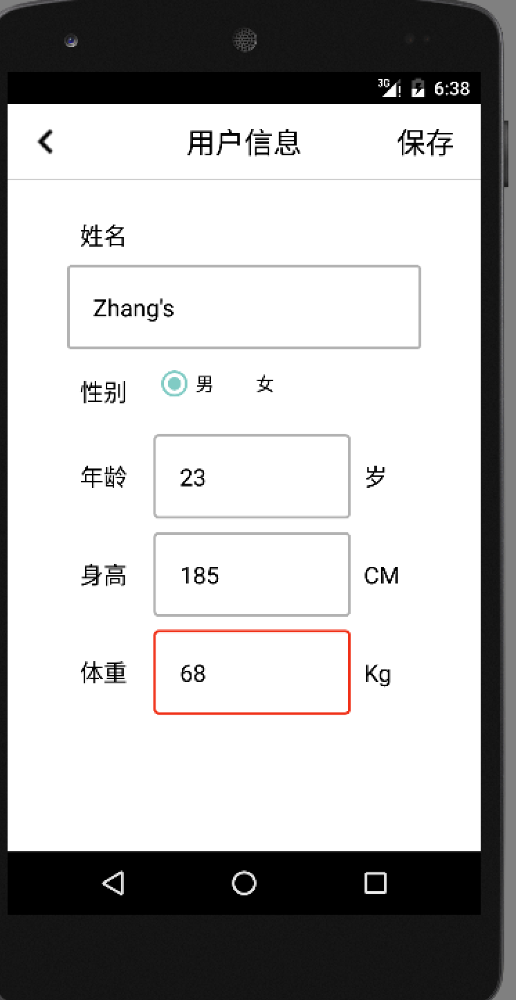

# for my classmates's research in school
高中同学的一个课题研究的Android App，也算是学习安卓的入门练手项目。

功能相对较为简单，本身不会安卓，代码写的也很挫，如果后续有机会做安卓开发，当做自己的笔记来参考。
主要设计以下知识点，备份下，说不定以后需要呢！

- Android UI布局
    - linearLayout
    - RelativeLayout
- ListView & Adapter
    - BaseAdapter
    - ViewHolder
- 安卓本地存储
    - SharePrefence
    - SQL Lite

- Activity 之间的切换
    - Intent
    - antivity 传值
- BroadCast
    - 闹钟 用到的BroadCast的接收
    - AlarmManager

部分截图

